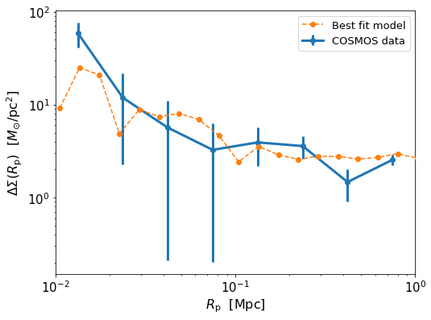
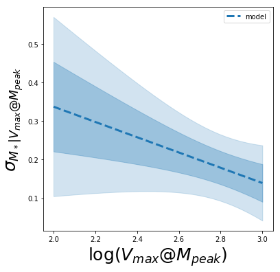

## Best fit model is from run `Vmax5`

# Directories
- `config`: config files for runs with different parameters.
- `logs`: output logs from various runs. Most useful for debugging.
- `notebooks`: notebooks for code development and visualizing results.
- `outfiles`: numpy arrays with MCMC samples from various runs.
- `plots`: some plots from results.

# Files
- `functions.py`: all functions used in MCMC located here.
- `run_dee_emcee.py`: script for runing MCMC (using emcee package). Config file passed as argument. Other arguments allow fitting to only SMF or only Delta Sigma. Originally written to run on Graymalkin machine.
  - example: `python MCMC/run_dee_emcee.py -config 1`

***

(Based off of Song's initial MCMC code from his ASAP model. That is why the structure might seem a bit more complex than it needs to be.)

